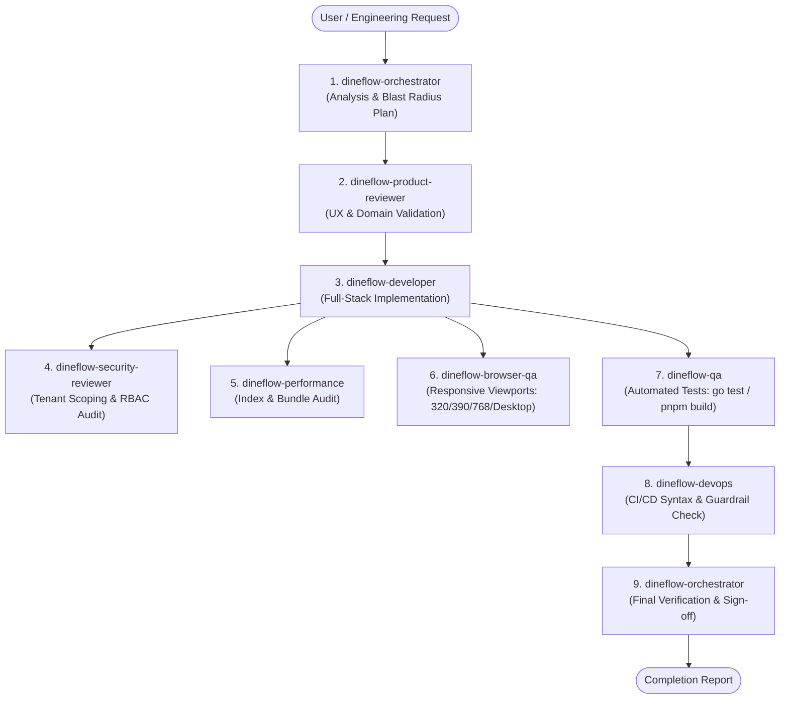

# DineFlow Multi-Agent System Architecture

This directory (`.agents/`) houses the project-local multi-agent governance, role definitions, and operational workflows for **DineFlow**, an enterprise-grade multi-tenant restaurant and hospitality operating system.

---

## 1. The Eight Primary Operational Roles

The DineFlow engineering system is organized around eight specialized agent personas coordinated by `dineflow-orchestrator`:

| # | Agent Role Name | Definition File | Primary Mandate & Scope |
| :-: | :--- | :--- | :--- |
| **1** | **`dineflow-orchestrator`** | [dineflow-orchestrator.md](file:///Users/himanshu.singh/Desktop/DineFlow/.agents/agents/dineflow-orchestrator.md) | **Lead Orchestration & Routing**: Coordinates end-to-end task decomposition, architecture planning, specialist handoffs, and final repository verification. |
| **2** | **`dineflow-developer`** | [dineflow-developer.md](file:///Users/himanshu.singh/Desktop/DineFlow/.agents/agents/dineflow-developer.md) | **Full-Stack Implementation**: Bridges Next.js 16/React 19/Tailwind frontend (`apps/web`) and Go 1.26/Gin/MongoDB backend (`apps/api`) with strict typing and clean layering. |
| **3** | **`dineflow-qa`** | [dineflow-qa.md](file:///Users/himanshu.singh/Desktop/DineFlow/.agents/agents/dineflow-qa.md) | **Automated Testing & Regression QA**: Implements and runs Go unit tests (`go test ./...`), API contract tests, boundary condition tests, and regression verification. |
| **4** | **`dineflow-browser-qa`** | [dineflow-browser-qa.md](file:///Users/himanshu.singh/Desktop/DineFlow/.agents/agents/dineflow-browser-qa.md) | **Responsive & Browser QA**: Validates layout integrity, touch targets ($\ge 44\text{px}$), horizontal overflow elimination, and dual-theme contrast across 320px, 390px, 768px, and desktop viewports. |
| **5** | **`dineflow-security-reviewer`** | [dineflow-security-reviewer.md](file:///Users/himanshu.singh/Desktop/DineFlow/.agents/agents/dineflow-security-reviewer.md) | **Security & Compliance Review**: Audits server-side `tenantId` isolation, zero-trust RBAC, IDOR prevention, cryptographic webhook signatures, NoSQL injection, and secret leakage guards. |
| **6** | **`dineflow-devops`** | [dineflow-devops.md](file:///Users/himanshu.singh/Desktop/DineFlow/.agents/agents/dineflow-devops.md) | **CI/CD & Infrastructure Reliability**: Validates local Docker Compose files, GitHub Actions workflows, health check pipelines, and enforces strict production safety guardrails. |
| **7** | **`dineflow-product-reviewer`** | [dineflow-product-reviewer.md](file:///Users/himanshu.singh/Desktop/DineFlow/.agents/agents/dineflow-product-reviewer.md) | **Hospitality Product & Domain Review**: Evaluates restaurant/hotel operational workflows (KDS, table ordering, room PMS, attendance), anti-ghost feature enforcement, and user story completeness. |
| **8** | **`dineflow-performance`** | [dineflow-performance.md](file:///Users/himanshu.singh/Desktop/DineFlow/.agents/agents/dineflow-performance.md) | **Performance & Scalability**: Audits MongoDB indexes (`tenantId` prefix), Redis caching strategies, sliding-window rate limiters, Next.js bundle footprint, and server resource bounds. |

---

## 2. Preserved Domain Specialists

In addition to the eight primary roles, the following deep-dive domain specialists are preserved in `.agents/agents/` for focused, single-domain assignments:

- **`dineflow-frontend`** ([dineflow-frontend.md](file:///Users/himanshu.singh/Desktop/DineFlow/.agents/agents/dineflow-frontend.md)): Deep-dive specialist in Next.js 16 App Router, React 19, Tailwind CSS v4, and the 21st.dev design token system.
- **`dineflow-backend`** ([dineflow-backend.md](file:///Users/himanshu.singh/Desktop/DineFlow/.agents/agents/dineflow-backend.md)): Deep-dive specialist in Go 1.26, Gin REST API handlers, MongoDB Atlas driver v2, and Redis caching.
- **`dineflow-security`** ([dineflow-security.md](file:///Users/himanshu.singh/Desktop/DineFlow/.agents/agents/dineflow-security.md)): Deep-dive specialist in cryptographic implementations, payment webhooks, and multi-tenant isolation protocols.

---

## 3. Technology Stack & Workspace Boundaries

```
DineFlow Monorepo/
├── apps/
│   ├── web/                     # Next.js 16.3.5, React 19.2.8, Tailwind CSS v4, Zustand 5.0
│   │   ├── app/                 # Next.js App Router (Dashboard, QR Portal /m/, Platform Admin)
│   │   ├── components/          # UI primitives (Radix UI, 21st.dev tokens) & feature modals
│   │   └── lib/                 # Stores (auth, tenant-data), Axios client, design-system tokens
│   └── api/                     # Go 1.26 REST API, Gin framework, MongoDB 7.0, Redis 7.2
│       ├── cmd/server/          # Entrypoint (main.go), seed data (seed.go)
│       ├── internal/
│       │   ├── application/     # Domain services (auth, menu, order, table, room, staff, etc.)
│       │   ├── domain/          # Entities & domain models (tenant, user, order, room, etc.)
│       │   ├── infrastructure/  # MongoDB client & indexes, Redis rate limiters, WebSocket hub
│       │   └── interfaces/http/ # Gin handlers, RBAC/auth middleware, routes under /api/v1/
├── deploy/                      # Deployment automation (deploy.sh, gen-secrets.sh)
├── docker-compose.yml           # Local dev multi-container stack
├── docker-compose.prod.yml      # Production stack specification
└── .github/workflows/           # CI/CD pipelines (ci.yml, deploy.yml)
```

---

## 4. Mandatory Architectural Invariants

### A. Server-Side Multi-Tenant Data Scoping
- **Context Extraction**: The authentication middleware (`middleware.Auth`) extracts `tenantId` from the verified JWT claims and sets it into `gin.Context`.
- **Query Scoping**: Every MongoDB filter and mutation on tenant resources MUST include `tenantId`. Never query tenant resources solely by resource ID:
  ```go
  // REQUIRED
  filter := bson.M{"_id": id, "tenantId": tenantID}
  ```

### B. Role-Based Access Control (RBAC)
- Routes must enforce explicit RBAC middleware (`OwnerOnly`, `OwnerOrManager`, `Staff`, `PlatformAdminOnly`).
- Staff roles (`waiter`, `kitchen`) must never access administrative financials, payroll, or platform configuration.

### C. Browser & Responsive Viewports
- Layouts must be verified across:
  - **320px**: Ultra-compact mobile (zero horizontal overflow, collapsed stats pills, sticky footers).
  - **390px**: Standard mobile (primary content above the fold, readable typography).
  - **768px**: Tablet & POS terminal (split panels, responsive drawers).
  - **1024px+ / Desktop**: Full operational dashboards.
- Touch targets must satisfy $\ge 44 \times 44\text{px}$.
- Inputs must use $\ge 16\text{px}$ (`text-base`) on mobile to prevent iOS Safari auto-zooming.
- Light and Dark modes must maintain high contrast complying with WCAG 2.1 AA.

### D. Safe Local Performance Benchmarks
- Database compound indexes must use `tenantId` as the leading prefix.
- Performance audits must use safe, read-only static analysis and local queries.
- Destructive load tests or stress benchmarking against live environments are strictly prohibited.

---

## 5. MANDATORY DEVOPS PRODUCTION GUARDRAILS

> [!CAUTION]
> **ABSOLUTE PRODUCTION IMMUTABILITY RULES**
> Autonomous agents operating in this repository must strictly adhere to these negative constraints:
> 1. **NO Remote Git Pushing**: Do not run `git push origin main` or any remote push during audit/inspection workflows.
> 2. **NO Remote Deploy Execution**: Do not execute `./deploy/deploy.sh` against remote VPS hosts.
> 3. **NO Workflow Dispatch**: Do not dispatch remote GitHub Actions workflows (`gh workflow run`).
> 4. **NO Remote SSH Access**: Do not initiate SSH sessions to production servers (`dine.rovixatech.com`).
> 5. **NO Remote Docker Commands**: Do not connect to or modify remote Docker hosts or daemons.
> 6. **NO Production Data Access**: Do not query or alter production MongoDB Atlas clusters or Redis stores.
> 7. **NO Secret Tampering**: Never alter or overwrite live production secrets or credentials.

---

## 6. Multi-Agent Coordination Lifecycle



---

## 7. Agent Discovery & Invocation

All agent definition files in `.agents/agents/*.md` contain standard YAML front matter:

```yaml
---
name: <agent-name>
description: <concise-description>
---
```

When invoking subagents through Antigravity tools:
- Call `invoke_subagent` with the agent's unique name (e.g. `dineflow-developer`, `dineflow-browser-qa`, `dineflow-security-reviewer`, `dineflow-devops`, `dineflow-product-reviewer`, `dineflow-performance`, `dineflow-orchestrator`, `dineflow-qa`).
- Follow the **Standard Agent Handoff Protocol** defined in [dineflow-orchestrator.md](file:///Users/himanshu.singh/Desktop/DineFlow/.agents/agents/dineflow-orchestrator.md).
