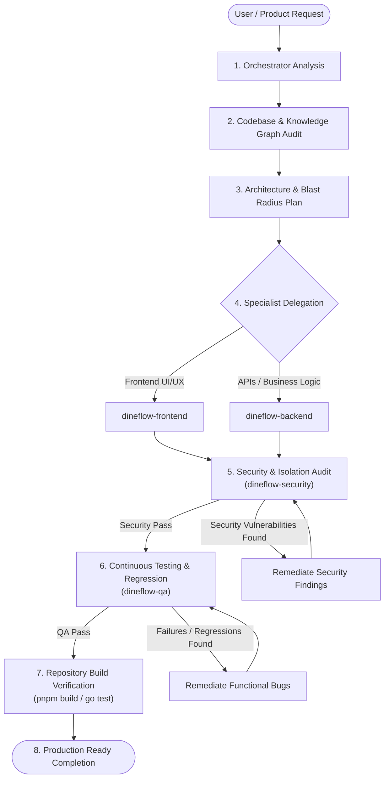

# DineFlow Autonomous Engineering Workflow

This document defines the production coordination lifecycle, delegation protocols, and cross-agent invariants governing the 5-agent DineFlow engineering system:
1. `dineflow-orchestrator` (Lead Coordination & Architectural Synthesis)
2. `dineflow-frontend` (Client Interfaces, Next.js, 21st.dev Design System)
3. `dineflow-backend` (Go API, Domain Services, MongoDB, Redis, Webhooks)
4. `dineflow-qa` (Verification, Failure Modes, Regression, E2E)
5. `dineflow-security` (Tenant Isolation, RBAC, Cryptography, Webhook Audit)

---

## 1. End-to-End Lifecycle Architecture

Every feature, bug fix, refactor, or infrastructure change follows this strict workflow pipeline:



---

## 2. The 10 Invariant Coordination Rules

These 10 rules govern all interactions between the 5 DineFlow agents:

1. **Rule 1 (Centralized Orchestration)**: The `dineflow-orchestrator` retains sole authority for task decomposition and planning. Specialist agents must not independently redesign architecture outside their scoped mandate.
2. **Rule 2 (Mandatory Pre-Audit)**: Every agent must inspect existing code, schemas, and components before proposing or modifying files. Assumptions are strictly prohibited.
3. **Rule 3 (Zero Overlapping Edits)**: The orchestrator assigns distinct file boundaries to each specialist. No two agents may edit the same file simultaneously without explicit sequencing.
4. **Rule 4 (Cross-Boundary Contract Communication)**: When `dineflow-backend` modifies an API schema or response contract, it must formally publish the updated TypeScript interfaces to `dineflow-frontend` and test scenarios to `dineflow-qa`.
5. **Rule 5 (Real API Grounding)**: Frontend components must be backed by real Go API endpoints and stores. `dineflow-frontend` must coordinate with `dineflow-backend` rather than fabricating mock frontend states.
6. **Rule 6 (Mandatory Security Gate)**: Every change touching authentication, RBAC, payment webhooks, session handling, or tenant data access must be reviewed and signed off by `dineflow-security`.
7. **Rule 7 (Continuous QA Sign-Off)**: Non-trivial feature additions and refactors require dedicated test coverage and regression verification by `dineflow-qa`.
8. **Rule 8 (No Verification, No Completion)**: An implementation is never marked complete until automated builds (`pnpm --filter web run build` and `go build ./...`) exit with code 0.
9. **Rule 9 (Anti-Ghost Invariant)**: Never create superficial UI states or dummy functions merely to appear complete. Every user action must have genuine end-to-end capability.
10. **Rule 10 (Empirical Truth)**: Never state that a test or build passed unless the command was actually executed and succeeded.

---

## 3. Standard Agent Handoff Protocol

When `dineflow-orchestrator` delegates tasks to specialized agents, or when specialists hand off results, they MUST communicate using this structured protocol:

```markdown
### AGENT HANDOFF DISPATCH
- **FROM**: [Originating Agent]
- **TO**: [Target Specialist Agent]
- **OBJECTIVE**: [High-level purpose of the assignment]

#### 1. TASK SPECIFICATION
[Concise description of the specific engineering change required.]

#### 2. ARCHITECTURAL CONTEXT
[Summary of existing systems, related components, models, and dependencies.]

#### 3. TARGET FILES & DIRECTORIES
- Primary File: `apps/web/app/dashboard/...`
- Secondary File: `apps/api/internal/application/...`

#### 4. CONSTRAINTS & INVARIANTS
- Do not modify existing API contracts.
- Maintain full Light/Dark mode contrast compliance.
- Strictly enforce `tenantId` filtering on server-side queries.

#### 5. DEPENDENCIES & CROSS-AGENT IMPACTS
- Blocked by: [e.g. Backend must implement `/api/v1/orders/refund` first]
- Blocks: [e.g. QA cannot run regression until UI is mounted]

#### 6. EXPECTED ARTIFACTS
- Concrete code diffs in targeted files.
- Automated tests covering happy and negative paths.

#### 7. VERIFICATION CRITERIA
- Automated command: `pnpm --filter web run build`
- Functional test case: [Specific condition that must pass]
```

---

## 4. Phase-by-Phase Execution Checklist

| Phase | Responsible Agent | Primary Artifacts & Actions | Verification Gate |
| :--- | :--- | :--- | :--- |
| **Phase 1: Ingestion & Audit** | `dineflow-orchestrator` | AST inspect, `graphify`, routes, schema review | Identified blast radius |
| **Phase 2: Architectural Plan** | `dineflow-orchestrator` | Task plan, file allocation, dependency ordering | User/System approval |
| **Phase 3: Backend Implementation** | `dineflow-backend` | Go Gin handlers, domain services, Mongo queries | `go build ./...` |
| **Phase 4: Frontend Implementation** | `dineflow-frontend` | Next.js components, Zustand stores, responsive design | `pnpm --filter web run build` |
| **Phase 5: Security Review** | `dineflow-security` | RBAC validation, tenant isolation audit, secret check | 0 Critical/High issues |
| **Phase 6: Quality Assurance** | `dineflow-qa` | Unit tests, failure mode testing, regression checks | 100% test pass rate |
| **Phase 7: Final Delivery** | `dineflow-orchestrator` | Build verification, walkthrough generation, report | Git commit & deployment ready |
