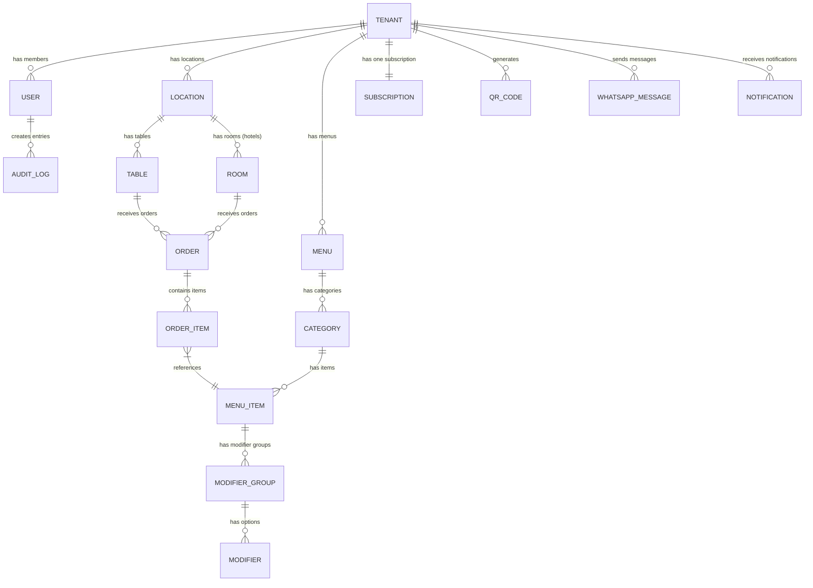

# DineFlow — Database Design

---

## Design Principles

1. **MongoDB as primary database** — document model fits the hierarchical nature of menus, orders, and tenants
2. **Every document scoped to `tenantId`** — enforced at the application layer; no cross-tenant query is possible without explicit tenantId
3. **Denormalization where it matters** — order items embed item name/price at time of order (price changes don't retroactively affect history)
4. **Compound indexes on `(tenantId, ...)` always** — ensures tenant isolation AND performance
5. **Soft deletes** — records are marked `deletedAt`, never hard-deleted (audit trail + recovery)
6. **Timestamps on all collections** — `createdAt`, `updatedAt` on every document
7. **Versioning** — subscription plan and menu item versions tracked

---

## Entity Relationship Overview



---

## Collections

---

### Collection: `tenants`

The root multi-tenant entity. Every other collection references this.

```json
{
  "_id": "ObjectId",
  "slug": "pizza-palace",
  "name": "Pizza Palace",
  "businessType": "restaurant",
  "plan": "growth",
  "status": "active",
  "logo": "https://cdn.dineflow.app/tenants/abc/logo.png",
  "timezone": "Asia/Kolkata",
  "currency": "INR",
  "country": "IN",
  "taxRate": 5.0,
  "contact": {
    "email": "owner@pizzapalace.com",
    "phone": "+919876543210",
    "whatsappPhone": "+919876543210"
  },
  "address": {
    "line1": "12, MG Road",
    "city": "Bengaluru",
    "state": "Karnataka",
    "pincode": "560001",
    "country": "IN"
  },
  "settings": {
    "operatingHours": {
      "monday": { "open": "09:00", "close": "23:00", "isOpen": true },
      "tuesday": { "open": "09:00", "close": "23:00", "isOpen": true }
    },
    "orderingEnabled": true,
    "requireGuestPhone": false,
    "autoAcceptOrders": false,
    "preparationTimeMinutes": 15,
    "orderingPageTheme": "default"
  },
  "features": {
    "kds": true,
    "whatsapp": true,
    "analytics": true,
    "multiLocation": false,
    "hotelModule": false,
    "customDomain": false,
    "aiSuggestions": false
  },
  "onboarding": {
    "completed": true,
    "steps": {
      "profile": true,
      "menu": true,
      "tables": true,
      "qrCodes": true,
      "whatsapp": false
    }
  },
  "createdAt": "ISODate",
  "updatedAt": "ISODate",
  "deletedAt": null
}
```

**Indexes:**
```
{ slug: 1 }                          // unique
{ "contact.email": 1 }              // unique
{ plan: 1, status: 1 }              // subscription queries
```

---

### Collection: `users`

Staff members and owners associated with a tenant.

```json
{
  "_id": "ObjectId",
  "tenantId": "ObjectId",
  "email": "riya@pizzapalace.com",
  "phone": "+919876543210",
  "name": "Riya Sharma",
  "avatar": "https://...",
  "role": "owner",
  "permissions": {
    "canManageMenu": true,
    "canManageStaff": true,
    "canViewAnalytics": true,
    "canManageBilling": true,
    "canManageOrders": true,
    "canAccessKDS": true
  },
  "pin": "hashed_pin",
  "auth": {
    "passwordHash": "bcrypt_hash",
    "refreshTokens": [
      {
        "token": "hashed_token",
        "expiresAt": "ISODate",
        "deviceInfo": "iPhone, Safari"
      }
    ],
    "lastLoginAt": "ISODate",
    "failedLoginAttempts": 0,
    "lockedUntil": null,
    "emailVerified": true,
    "phoneVerified": true
  },
  "notificationPrefs": {
    "newOrder": { "sound": true, "browser": true, "whatsapp": false },
    "billing": { "email": true, "whatsapp": true }
  },
  "invitedBy": "ObjectId",
  "inviteToken": null,
  "inviteExpiresAt": null,
  "status": "active",
  "createdAt": "ISODate",
  "updatedAt": "ISODate"
}
```

**Roles:** `owner`, `manager`, `chef`, `waiter`, `cashier`

**Indexes:**
```
{ tenantId: 1, email: 1 }           // unique
{ tenantId: 1, role: 1 }
{ "auth.refreshTokens.token": 1 }
```

---

### Collection: `subscriptions`

One subscription per tenant. Tracks the full billing lifecycle.

```json
{
  "_id": "ObjectId",
  "tenantId": "ObjectId",
  "plan": "growth",
  "status": "active",
  "billingCycle": "monthly",
  "currency": "INR",
  "amount": 2999,
  "provider": "razorpay",
  "providerSubscriptionId": "sub_Nxxx",
  "providerCustomerId": "cust_Nxxx",
  "currentPeriodStart": "ISODate",
  "currentPeriodEnd": "ISODate",
  "cancelAtPeriodEnd": false,
  "canceledAt": null,
  "gracePeriodStart": null,
  "gracePeriodEnd": null,
  "gracePeriodDays": 14,
  "downgradedAt": null,
  "previousPlan": null,
  "trialStart": "ISODate",
  "trialEnd": "ISODate",
  "paymentHistory": [
    {
      "invoiceId": "inv_001",
      "amount": 2999,
      "currency": "INR",
      "status": "paid",
      "paidAt": "ISODate",
      "paymentId": "pay_Nxxx",
      "invoiceUrl": "https://..."
    }
  ],
  "webhookEvents": [
    { "event": "payment.captured", "processedAt": "ISODate", "idempotencyKey": "evt_xxx" }
  ],
  "createdAt": "ISODate",
  "updatedAt": "ISODate"
}
```

**Indexes:**
```
{ tenantId: 1 }                      // unique
{ status: 1, currentPeriodEnd: 1 }  // grace period cron
{ providerSubscriptionId: 1 }       // webhook lookups
```

---

### Collection: `locations`

Supports multi-location businesses (Phase 5+). Single-location tenants still have one document here.

```json
{
  "_id": "ObjectId",
  "tenantId": "ObjectId",
  "name": "MG Road Branch",
  "type": "restaurant",
  "address": { "line1": "...", "city": "Bengaluru" },
  "phone": "+91...",
  "isDefault": true,
  "settings": {
    "orderingEnabled": true,
    "preparationTimeMinutes": 12
  },
  "createdAt": "ISODate",
  "updatedAt": "ISODate",
  "deletedAt": null
}
```

**Indexes:**
```
{ tenantId: 1 }
{ tenantId: 1, isDefault: 1 }
```

---

### Collection: `tables`

Restaurant tables or hotel rooms. QR codes link to these.

```json
{
  "_id": "ObjectId",
  "tenantId": "ObjectId",
  "locationId": "ObjectId",
  "type": "table",
  "name": "Table 4",
  "number": 4,
  "capacity": 4,
  "section": "Ground Floor",
  "status": "available",
  "qrCodeId": "ObjectId",
  "position": { "x": 120, "y": 340 },
  "createdAt": "ISODate",
  "updatedAt": "ISODate",
  "deletedAt": null
}
```

**Table Status:** `available`, `occupied`, `reserved`, `billing`, `unavailable`  
**Type:** `table`, `room`, `counter`, `outdoor`

**Indexes:**
```
{ tenantId: 1, locationId: 1 }
{ tenantId: 1, status: 1 }
```

---

### Collection: `qr_codes`

Each QR code links to a table/room at a specific tenant.

```json
{
  "_id": "ObjectId",
  "tenantId": "ObjectId",
  "tableId": "ObjectId",
  "locationId": "ObjectId",
  "url": "https://order.dineflow.app/pizza-palace/table-4",
  "shortCode": "PP-T4-A3X9",
  "version": 1,
  "isActive": true,
  "branding": {
    "logoUrl": "https://...",
    "primaryColor": "#E63946",
    "style": "rounded"
  },
  "analytics": {
    "totalScans": 147,
    "uniqueScans": 89,
    "conversionRate": 0.72,
    "lastScannedAt": "ISODate"
  },
  "generatedAt": "ISODate",
  "regeneratedAt": null
}
```

**Indexes:**
```
{ tenantId: 1, tableId: 1 }
{ shortCode: 1 }                     // unique
{ url: 1 }                           // unique
```

---

### Collection: `menus`

A tenant can have multiple menus (dine-in, takeaway, room service).

```json
{
  "_id": "ObjectId",
  "tenantId": "ObjectId",
  "locationId": "ObjectId",
  "name": "Dine-In Menu",
  "type": "dine-in",
  "isDefault": true,
  "isActive": true,
  "availability": {
    "always": true,
    "schedule": null
  },
  "currency": "INR",
  "createdAt": "ISODate",
  "updatedAt": "ISODate"
}
```

**Menu Types:** `dine-in`, `takeaway`, `delivery`, `room-service`, `bar`

---

### Collection: `categories`

Menu sections (e.g., Starters, Mains, Desserts).

```json
{
  "_id": "ObjectId",
  "tenantId": "ObjectId",
  "menuId": "ObjectId",
  "name": "Pizzas",
  "description": "Wood-fired artisan pizzas",
  "image": "https://...",
  "sortOrder": 2,
  "isActive": true,
  "availability": {
    "always": true,
    "startTime": null,
    "endTime": null,
    "days": null
  },
  "createdAt": "ISODate",
  "updatedAt": "ISODate",
  "deletedAt": null
}
```

---

### Collection: `menu_items`

Individual dishes/drinks.

```json
{
  "_id": "ObjectId",
  "tenantId": "ObjectId",
  "menuId": "ObjectId",
  "categoryId": "ObjectId",
  "name": "Margherita Pizza",
  "description": "Classic tomato sauce, fresh mozzarella, basil",
  "image": "https://...",
  "basePrice": 349,
  "currency": "INR",
  "taxRate": 5.0,
  "isAvailable": true,
  "isFeatured": false,
  "sortOrder": 1,
  "tags": ["vegetarian", "bestseller"],
  "dietaryInfo": {
    "isVegan": false,
    "isVegetarian": true,
    "isGlutenFree": false,
    "isSpicy": false,
    "spiceLevel": 0,
    "allergens": ["gluten", "dairy"]
  },
  "variants": [
    { "id": "uuid", "name": "Small (8\")", "additionalPrice": 0 },
    { "id": "uuid", "name": "Medium (10\")", "additionalPrice": 100 },
    { "id": "uuid", "name": "Large (12\")", "additionalPrice": 200 }
  ],
  "modifierGroups": [
    {
      "id": "ObjectId",
      "name": "Extra Toppings",
      "required": false,
      "multiSelect": true,
      "min": 0,
      "max": 3
    }
  ],
  "preparationTime": 12,
  "analytics": {
    "totalOrders": 1247,
    "totalRevenue": 434603,
    "lastOrderedAt": "ISODate"
  },
  "createdAt": "ISODate",
  "updatedAt": "ISODate",
  "deletedAt": null
}
```

**Indexes:**
```
{ tenantId: 1, menuId: 1, categoryId: 1 }
{ tenantId: 1, isAvailable: 1 }
{ tenantId: 1, "analytics.totalOrders": -1 }   // popular items
```

---

### Collection: `modifier_groups`

```json
{
  "_id": "ObjectId",
  "tenantId": "ObjectId",
  "name": "Extra Toppings",
  "required": false,
  "multiSelect": true,
  "min": 0,
  "max": 3,
  "modifiers": [
    { "id": "uuid", "name": "Extra Cheese", "price": 50, "isAvailable": true },
    { "id": "uuid", "name": "Jalapeños", "price": 30, "isAvailable": true },
    { "id": "uuid", "name": "Olives", "price": 30, "isAvailable": true }
  ],
  "createdAt": "ISODate",
  "updatedAt": "ISODate"
}
```

---

### Collection: `orders`

The central business object. Denormalized for historical accuracy.

```json
{
  "_id": "ObjectId",
  "tenantId": "ObjectId",
  "locationId": "ObjectId",
  "orderNumber": "PP-20260912-0047",
  "type": "dine-in",
  "status": "preparing",
  "tableId": "ObjectId",
  "tableName": "Table 4",
  "roomId": null,
  "roomNumber": null,
  "guest": {
    "name": "Priya K.",
    "phone": "+919876543210",
    "whatsappOptIn": true
  },
  "items": [
    {
      "id": "uuid",
      "menuItemId": "ObjectId",
      "name": "Margherita Pizza",
      "image": "https://...",
      "basePrice": 349,
      "variantId": "uuid",
      "variantName": "Medium (10\")",
      "variantPrice": 100,
      "modifiers": [
        { "groupName": "Extra Toppings", "name": "Extra Cheese", "price": 50 }
      ],
      "quantity": 1,
      "specialInstructions": "Extra crispy please",
      "itemTotal": 499,
      "status": "preparing"
    }
  ],
  "pricing": {
    "subtotal": 499,
    "taxRate": 5.0,
    "taxAmount": 24.95,
    "discountCode": null,
    "discountAmount": 0,
    "total": 523.95,
    "currency": "INR"
  },
  "payment": {
    "method": null,
    "status": "unpaid",
    "transactionId": null,
    "paidAt": null
  },
  "statusTimeline": [
    { "status": "received", "at": "ISODate", "byUserId": null },
    { "status": "preparing", "at": "ISODate", "byUserId": "ObjectId" }
  ],
  "estimatedReadyAt": "ISODate",
  "acceptedBy": "ObjectId",
  "servedBy": "ObjectId",
  "notes": "Birthday table, please add a candle",
  "round": 1,
  "source": "qr",
  "kdsStations": ["main-kitchen"],
  "createdAt": "ISODate",
  "updatedAt": "ISODate"
}
```

**Order Status:** `received`, `accepted`, `preparing`, `ready`, `served`, `cancelled`, `partially_served`  
**Order Type:** `dine-in`, `room-service`, `takeaway`, `manual`  
**Source:** `qr`, `staff`, `api`

**Indexes:**
```
{ tenantId: 1, status: 1, createdAt: -1 }
{ tenantId: 1, tableId: 1, status: 1 }
{ tenantId: 1, createdAt: -1 }               // order history
{ tenantId: 1, "guest.phone": 1 }           // customer lookup
{ orderNumber: 1 }                           // unique
```

---

### Collection: `whatsapp_messages`

Audit log for all WhatsApp messages sent.

```json
{
  "_id": "ObjectId",
  "tenantId": "ObjectId",
  "orderId": "ObjectId",
  "to": "+919876543210",
  "template": "order_confirmed",
  "variables": { "name": "Priya", "order_id": "PP-0047", "eta": "12 min" },
  "status": "delivered",
  "providerMessageId": "wamid.xxx",
  "sentAt": "ISODate",
  "deliveredAt": "ISODate",
  "readAt": null,
  "failedAt": null,
  "failureReason": null
}
```

---

### Collection: `audit_logs`

```json
{
  "_id": "ObjectId",
  "tenantId": "ObjectId",
  "actorId": "ObjectId",
  "actorRole": "manager",
  "action": "menu_item.updated",
  "resourceType": "menu_item",
  "resourceId": "ObjectId",
  "changes": {
    "before": { "isAvailable": true },
    "after": { "isAvailable": false }
  },
  "ipAddress": "203.x.x.x",
  "userAgent": "Chrome/...",
  "createdAt": "ISODate"
}
```

---

### Collection: `notifications`

In-app notifications for staff/owners.

```json
{
  "_id": "ObjectId",
  "tenantId": "ObjectId",
  "userId": "ObjectId",
  "type": "new_order",
  "title": "New order at Table 4",
  "body": "Margherita Pizza x1, Garlic Bread x2",
  "data": { "orderId": "ObjectId", "tableId": "ObjectId" },
  "isRead": false,
  "readAt": null,
  "createdAt": "ISODate"
}
```

---

## Index Strategy Summary

| Collection | Key Indexes | Purpose |
|---|---|---|
| tenants | `slug`, `email` | Tenant lookup by subdomain or login |
| users | `(tenantId, email)`, `role` | Auth, staff management |
| subscriptions | `(status, periodEnd)` | Grace period cron job |
| orders | `(tenantId, status, createdAt)` | Live order feed, KDS |
| menu_items | `(tenantId, menuId, available)` | Menu rendering |
| qr_codes | `shortCode`, `url` | QR resolution |

---

## Data Retention Policy

| Data | Retention |
|---|---|
| Orders | Forever (hard delete never) |
| WhatsApp messages | 2 years |
| Audit logs | 5 years |
| Soft-deleted tenants | 90 days, then purged |
| Refresh tokens | 7 days (auto-expiry in TTL index) |

---

*Last Updated: September 2026 | Version: 1.0*
