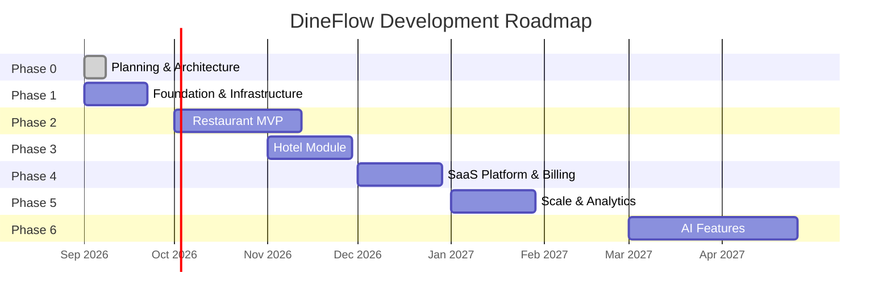
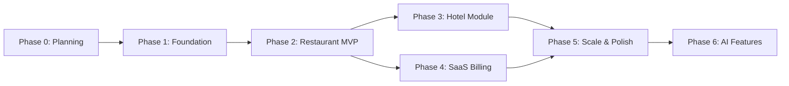

# DineFlow — Feature Roadmap

---

## Overview

This roadmap organizes the entire DineFlow product into **6 phases**, from foundation setup to AI-powered features. Each phase has clear goals, deliverables, dependencies, priorities, and estimated timelines.

---

## Phasing Summary

---

## Phase 0 — Planning & Architecture

**Goal**: Finalize all planning documents, design system, and technical decisions before writing a single line of application code.

**Timeline**: Week 1  
**Status**: ✅ In Progress

### Deliverables

| # | Deliverable | Priority | Status |
|---|---|---|---|
| 0.1 | Product Vision (PRODUCT_VISION.md) | P0 | ✅ Done |
| 0.2 | Product Requirements (PRODUCT_REQUIREMENTS.md) | P0 | ✅ Done |
| 0.3 | Feature Roadmap (FEATURE_ROADMAP.md) | P0 | ✅ Done |
| 0.4 | System Architecture (SYSTEM_ARCHITECTURE.md) | P0 | ✅ Done |
| 0.5 | Database Design (DATABASE_DESIGN.md) | P0 | ✅ Done |
| 0.6 | API Strategy (API_STRATEGY.md) | P0 | ✅ Done |
| 0.7 | UI/UX Guidelines (UI_UX_GUIDELINES.md) | P0 | ✅ Done |
| 0.8 | Subscription Model (SUBSCRIPTION_MODEL.md) | P0 | ✅ Done |
| 0.9 | Development Plan (DEVELOPMENT_PLAN.md) | P0 | ✅ Done |
| 0.10 | Questions & Assumptions (QUESTIONS_AND_ASSUMPTIONS.md) | P0 | ✅ Done |

**Dependencies**: None  
**Acceptance Criteria**: All 10 planning documents reviewed and approved by stakeholders.

---

## Phase 1 — Foundation & Infrastructure

**Goal**: Set up the technical skeleton. No business features yet — only the infrastructure that all features will be built on.

**Timeline**: Weeks 2–4  
**Effort**: ~3 weeks (2 engineers)

### Deliverables

| # | Deliverable | Priority | Effort |
|---|---|---|---|
| 1.1 | Monorepo setup (Next.js frontend + Go/Node backend) | P0 | 2d |
| 1.2 | CI/CD pipeline (GitHub Actions) | P0 | 1d |
| 1.3 | Docker Compose (local dev) | P0 | 1d |
| 1.4 | MongoDB Atlas setup with tenant isolation | P0 | 2d |
| 1.5 | Redis (caching, rate limiting, pub/sub) | P0 | 1d |
| 1.6 | Authentication service (JWT + refresh tokens) | P0 | 3d |
| 1.7 | Multi-tenant middleware (tenant resolution by subdomain/header) | P0 | 2d |
| 1.8 | Role-based access control (RBAC) middleware | P0 | 2d |
| 1.9 | Environment configuration & secrets management | P0 | 1d |
| 1.10 | Error tracking (Sentry) + logging (structured JSON) | P1 | 1d |
| 1.11 | Email service (Resend/SendGrid) | P0 | 1d |
| 1.12 | File storage (Cloudflare R2 / AWS S3) | P0 | 1d |
| 1.13 | Design system tokens & component library scaffolding | P0 | 3d |
| 1.14 | Base layout components (Sidebar, TopBar, Modal, Toast) | P0 | 2d |

**Dependencies**: Phase 0 approval  
**Acceptance Criteria**:
- Auth flow works end-to-end (register → login → refresh)
- Two test tenants isolated from each other in DB
- CI pipeline runs on every PR

---

## Phase 2 — Restaurant MVP

**Goal**: Launch a fully working restaurant experience. A restaurant owner can register, build a menu, generate QR codes, and start receiving orders in the kitchen.

**Timeline**: Weeks 5–10  
**Effort**: ~6 weeks (3 engineers)

### 2A — Business Onboarding

| # | Feature | Priority | Effort |
|---|---|---|---|
| 2A.1 | Registration + OTP flow | P0 | 2d |
| 2A.2 | Business type selection wizard | P0 | 1d |
| 2A.3 | Business profile setup | P0 | 1d |
| 2A.4 | Onboarding checklist | P1 | 1d |
| 2A.5 | Sample menu auto-population | P1 | 1d |

### 2B — Menu Management

| # | Feature | Priority | Effort |
|---|---|---|---|
| 2B.1 | Category CRUD | P0 | 1d |
| 2B.2 | Menu item CRUD with image upload | P0 | 2d |
| 2B.3 | Item availability toggle | P0 | 0.5d |
| 2B.4 | Modifiers / add-ons | P0 | 2d |
| 2B.5 | Variants (size/type) | P0 | 1d |
| 2B.6 | Dietary tags | P1 | 0.5d |
| 2B.7 | Tax configuration | P1 | 1d |

### 2C — QR Code System

| # | Feature | Priority | Effort |
|---|---|---|---|
| 2C.1 | Table creation and management | P0 | 1d |
| 2C.2 | QR code generation per table | P0 | 1d |
| 2C.3 | QR download (PNG + PDF) | P0 | 0.5d |
| 2C.4 | Branded QR codes | P1 | 1d |

### 2D — Customer Ordering Experience

| # | Feature | Priority | Effort |
|---|---|---|---|
| 2D.1 | Mobile menu page (QR landing page) | P0 | 3d |
| 2D.2 | Cart management | P0 | 2d |
| 2D.3 | Order placement with name/phone | P0 | 1d |
| 2D.4 | Order confirmation page | P0 | 1d |
| 2D.5 | Real-time order status tracking | P0 | 2d |
| 2D.6 | Special instructions per item | P0 | 0.5d |
| 2D.7 | Call waiter / request bill buttons | P1 | 1d |

### 2E — Order Management (Staff Dashboard)

| # | Feature | Priority | Effort |
|---|---|---|---|
| 2E.1 | Live orders page with WebSocket updates | P0 | 3d |
| 2E.2 | Accept/reject order flow | P0 | 1d |
| 2E.3 | Order status updates | P0 | 1d |
| 2E.4 | Sound + browser notifications | P0 | 1d |
| 2E.5 | Order history view | P0 | 1d |
| 2E.6 | Manual order creation | P1 | 2d |

### 2F — Kitchen Display System

| # | Feature | Priority | Effort |
|---|---|---|---|
| 2F.1 | KDS full-screen view | P0 | 2d |
| 2F.2 | Order cards with time elapsed | P0 | 1d |
| 2F.3 | Color-coded urgency tiers | P0 | 0.5d |
| 2F.4 | Mark items / full order done | P0 | 1d |
| 2F.5 | Audio alert on new order | P0 | 0.5d |

### 2G — Basic Analytics

| # | Feature | Priority | Effort |
|---|---|---|---|
| 2G.1 | Today's revenue widget | P0 | 1d |
| 2G.2 | Order count and average value | P0 | 0.5d |
| 2G.3 | Top-selling items | P0 | 1d |

**Dependencies**: Phase 1 complete  
**Acceptance Criteria**:
- Complete ordering flow from QR scan to KDS display in < 3 seconds
- 2 restaurants tested in parallel with data isolation confirmed
- No P0 bugs in ordering flow

---

## Phase 3 — Hotel Module

**Goal**: Extend the platform to support hotels with room-based ordering, multi-outlet management, and in-room dining.

**Timeline**: Weeks 11–14  
**Effort**: ~4 weeks (2 engineers)

| # | Feature | Priority | Effort |
|---|---|---|---|
| 3.1 | Room directory management | P0 | 1d |
| 3.2 | QR codes for rooms (room number embedded) | P0 | 1d |
| 3.3 | Multi-outlet support (restaurant + bar + room service) | P0 | 3d |
| 3.4 | Room service ordering flow | P0 | 2d |
| 3.5 | Orders tagged by room number | P0 | 0.5d |
| 3.6 | Floor/wing filtering in dashboard | P1 | 1d |
| 3.7 | Hotel Pro plan feature gating | P0 | 1d |
| 3.8 | In-room dining menu (breakfast/lunch/dinner schedule) | P1 | 2d |
| 3.9 | Room charge to folio flag (future PMS) | P2 | 1d |
| 3.10 | Multi-outlet analytics (per outlet revenue) | P1 | 2d |

**Dependencies**: Phase 2 complete  
**Acceptance Criteria**:
- Room 312 order appears in KDS tagged "Room 312"
- Multi-outlet orders routed to correct KDS station
- Hotel Pro plan gating verified

---

## Phase 4 — SaaS Platform & Billing

**Goal**: Turn DineFlow into a self-serve SaaS business with automated billing, plan management, and subscription lifecycle.

**Timeline**: Weeks 15–18  
**Effort**: ~4 weeks (2 engineers)

| # | Feature | Priority | Effort |
|---|---|---|---|
| 4.1 | Razorpay / Stripe subscription integration | P0 | 3d |
| 4.2 | Plan selection UI (pricing page) | P0 | 2d |
| 4.3 | Subscription creation on checkout | P0 | 2d |
| 4.4 | Webhook handling (payment success/failure) | P0 | 2d |
| 4.5 | Grace period automation (14-day countdown) | P0 | 2d |
| 4.6 | Automatic downgrade to Free on expiry | P0 | 1d |
| 4.7 | Feature flag enforcement in API + UI | P0 | 2d |
| 4.8 | Invoice generation (PDF) | P1 | 2d |
| 4.9 | Billing portal (view invoices, change plan) | P1 | 2d |
| 4.10 | Admin super-dashboard (internal) | P1 | 3d |
| 4.11 | WhatsApp billing alerts | P1 | 1d |
| 4.12 | Plan limit enforcement (e.g., max 5 tables on Free) | P0 | 2d |

**Dependencies**: Phase 2 complete  
**Acceptance Criteria**:
- Subscription lifecycle (active → past_due → grace → free) automated end-to-end
- Feature flags block Growth features for Free plan users
- Stripe webhooks handled idempotently

---

## Phase 5 — Scale, Analytics & Polish

**Goal**: Harden the platform for scale, deepen analytics, and achieve product-market fit polish.

**Timeline**: Weeks 19–22  
**Effort**: ~4 weeks (3 engineers)

| # | Feature | Priority | Effort |
|---|---|---|---|
| 5.1 | Advanced analytics dashboard | P0 | 4d |
| 5.2 | Time-of-day heatmap | P1 | 2d |
| 5.3 | Menu item performance report | P1 | 2d |
| 5.4 | Export CSV/PDF reports | P1 | 1d |
| 5.5 | WhatsApp full integration (status updates) | P0 | 3d |
| 5.6 | Thermal printer integration | P1 | 2d |
| 5.7 | Load testing & performance optimization | P0 | 3d |
| 5.8 | Security audit (OWASP) | P0 | 3d |
| 5.9 | Accessibility audit (WCAG 2.1 AA) | P1 | 2d |
| 5.10 | Custom subdomain for ordering page | P2 | 2d |
| 5.11 | Customer feedback / rating system | P2 | 2d |
| 5.12 | Multi-location support (one business, many outlets) | P1 | 3d |

**Dependencies**: Phase 4 complete  
**Acceptance Criteria**:
- 500 concurrent orders processed without degradation
- OWASP Top 10 scan passes
- All P0 analytics metrics live

---

## Phase 6 — AI Features

**Goal**: Introduce AI-powered features that differentiate DineFlow from all competitors.

**Timeline**: Q2 2027  
**Effort**: ~8 weeks (2 engineers + 1 ML engineer)

| # | Feature | Priority | Effort |
|---|---|---|---|
| 6.1 | AI menu recommendations ("Add chips to burger?") | P1 | 3w |
| 6.2 | Demand forecasting (what to prep today) | P1 | 4w |
| 6.3 | Smart pricing suggestions (peak/off-peak) | P2 | 2w |
| 6.4 | Automated WhatsApp ordering chatbot | P2 | 4w |
| 6.5 | AI-generated menu descriptions | P1 | 1w |
| 6.6 | Voice ordering (experimental) | P3 | 6w |
| 6.7 | Inventory cost tracking with profit margins | P1 | 3w |

**Dependencies**: Phase 5 complete, sufficient data volume (3+ months)  
**Acceptance Criteria**: AI recommendation click-through rate > 15%

---

## Priority Legend

| Priority | Meaning |
|---|---|
| **P0** | Must have — product fails without this |
| **P1** | Should have — important for launch quality |
| **P2** | Nice to have — add when capacity allows |
| **P3** | Future — backlog for later phases |

---

## Cross-Phase Dependencies Map

---

*Last Updated: September 2026 | Version: 1.0*
