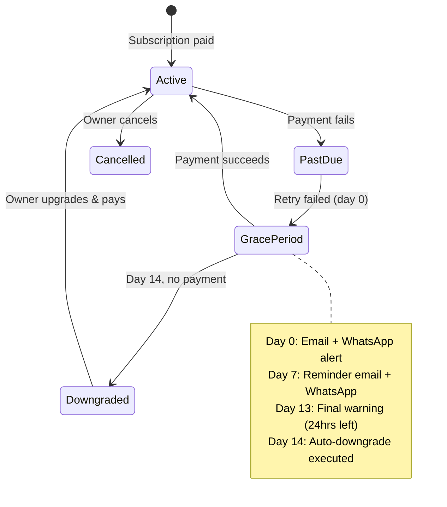

# DineFlow — Subscription Model

---

## Overview

DineFlow uses a **tiered subscription model** with four plans designed to grow with the customer. The model is built around three key goals:

1. **Low barrier to entry** — Free plan lets any business start immediately, no credit card required
2. **Feature-gated growth** — each upgrade unlocks meaningful, mission-critical features
3. **Operator safety** — a grace period protects businesses from being cut off abruptly during billing failures

---

## Subscription Plans

### Plan Comparison Table

| Feature | 🆓 Free | 🚀 Starter | 📈 Growth | 🏨 Hotel Pro |
|---|:---:|:---:|:---:|:---:|
| **Price (Monthly)** | ₹0 | ₹999 | ₹2,999 | ₹7,999 |
| **Price (Annual, per month)** | ₹0 | ₹799 | ₹2,399 | ₹6,399 |
| **Annual Discount** | — | 20% | 20% | 20% |
| **Tables / QR Codes** | 5 | 20 | 100 | Unlimited |
| **Menu Items** | 30 | 100 | Unlimited | Unlimited |
| **Staff Members** | 2 | 5 | 25 | Unlimited |
| **Locations** | 1 | 1 | 3 | Unlimited |
| **Orders per month** | 200 | Unlimited | Unlimited | Unlimited |
| **Menu Categories** | 5 | 15 | Unlimited | Unlimited |
| **QR Code Downloads** | ✅ PNG only | ✅ PNG + PDF | ✅ Branded | ✅ White-label |
| **Kitchen Display System** | ✅ Basic | ✅ Full | ✅ Full | ✅ Multi-station |
| **WhatsApp Notifications** | ❌ | ✅ Order confirm | ✅ All events | ✅ All events |
| **Analytics** | ✅ Basic (7 days) | ✅ Standard (30 days) | ✅ Advanced (1 year) | ✅ Full (All-time) |
| **Analytics Export** | ❌ | ❌ | ✅ CSV | ✅ CSV + PDF |
| **Custom Branding (QR)** | ❌ | ❌ | ✅ | ✅ |
| **Online Payment** | ❌ | ✅ | ✅ | ✅ |
| **Multi-outlet Support** | ❌ | ❌ | ✅ (3 locations) | ✅ Unlimited |
| **Hotel Module (Rooms)** | ❌ | ❌ | ❌ | ✅ |
| **Floor Plan Builder** | ❌ | ✅ | ✅ | ✅ |
| **Custom Subdomain** | ❌ | ❌ | ✅ | ✅ |
| **Priority Support** | ❌ | Email | Email + Chat | Dedicated manager |
| **Thermal Printer** | ❌ | ✅ | ✅ | ✅ |
| **AI Features (Phase 6)** | ❌ | ❌ | ✅ | ✅ |
| **SLA Uptime Guarantee** | None | 99.5% | 99.9% | 99.95% |
| **Data Retention** | 90 days | 1 year | Forever | Forever |
| **White-label** | ❌ | ❌ | ❌ | Add-on (+₹4,999) |

---

## Plan Definitions

### 🆓 Free — "Just Getting Started"

**Target**: Food trucks, first-timers, pop-ups, businesses evaluating DineFlow.

**Positioning**: No cost, no risk. Get your QR code and first order in 15 minutes.

**Hard Limits**:
- 5 tables (hard cap — creating a 6th table returns `HTTP 403 PLAN_LIMIT_EXCEEDED`)
- 30 menu items
- 200 orders/month (after limit, ordering page shows "Ordering temporarily unavailable. Contact the restaurant.")
- Data older than 90 days is archived (readable, not queryable in analytics)

---

### 🚀 Starter — "Open for Business" — ₹999/month

**Target**: Cafés, small restaurants, ghost kitchens with 1 location.

**Positioning**: Everything you need to run a real restaurant. Under ₹1000/month.

**Key Unlocks over Free**:
- 20 tables (4× more)
- WhatsApp order confirmations (high-value feature)
- Floor plan builder
- Thermal printer integration
- Standard analytics (30 days)

---

### 📈 Growth — "Scaling Up" — ₹2,999/month

**Target**: Established restaurants, 2–3 location chains, serious cloud kitchens.

**Positioning**: Unlimited menus, staff, and advanced features. The operator's plan.

**Key Unlocks over Starter**:
- Unlimited tables, menu items, staff
- Multi-location support (up to 3)
- Custom subdomain (e.g., `order.pizzapalace.com`)
- Branded QR codes with logo
- Advanced analytics (1-year history, heatmaps, item performance)
- CSV export
- AI features (Phase 6)

---

### 🏨 Hotel Pro — "Enterprise Hospitality" — ₹7,999/month

**Target**: Hotels, resorts, large restaurant groups, multi-outlet F&B operations.

**Positioning**: The only SaaS platform built for hotel F&B. Everything, unlimited.

**Key Unlocks over Growth**:
- Hotel module (room-based ordering, room directory)
- Unlimited locations and outlets
- Multi-station KDS
- White-label option (+₹4,999/month)
- Dedicated account manager
- 99.95% SLA

---

## Billing Mechanics

### Billing Cycle Options

| Cycle | Discount | Notes |
|---|---|---|
| Monthly | 0% | Cancel anytime, prorated on upgrade |
| Annual (paid upfront) | 20% | 2 months free effectively |

### Payment Providers

| Market | Provider | Currencies |
|---|---|---|
| India | **Razorpay** | INR |
| Global | **Stripe** | USD, AED, SGD, GBP, EUR |

Both providers support:
- Recurring subscriptions (webhook-driven lifecycle)
- Automatic retries on failure (3 attempts over 7 days)
- Proration on mid-cycle upgrade
- Customer portal (view invoices, update card)

### Upgrade / Downgrade Rules

| Action | Timing | Billing |
|---|---|---|
| **Upgrade** (e.g., Starter → Growth) | Immediate | Prorated charge for remainder of cycle |
| **Downgrade** (e.g., Growth → Starter) | End of current billing period | No refund; features stay until period end |
| **Cancel** | End of current billing period | Access continues until period end |

When downgrading:
- **Data is preserved** — no deletion
- **Limits enforced** — new orders blocked if over new plan's limits
- **Staff over limit** — excess staff accounts set to `inactive` (not deleted); re-activate on upgrade
- **Tables over limit** — excess tables set to `inactive`; QR codes still resolve but show "Temporarily unavailable"

---

## Grace Period & Downgrade Automation

### Grace Period Flow



### Grace Period Timeline

| Day | Action |
|---|---|
| **Day 0** (payment fails) | Mark subscription `past_due`; start grace period; send email + WhatsApp |
| **Day 1–6** | Razorpay/Stripe auto-retries payment (configured: day 3, day 7) |
| **Day 7** | Send reminder email + WhatsApp; show banner in dashboard |
| **Day 13** | Final warning email + WhatsApp: "24 hours remaining" |
| **Day 14** | If still unpaid: execute downgrade to Free plan; send downgrade confirmation |

### Downgrade Execution (Day 14)

```
1. Set tenant.plan = "free"
2. Set tenant.subscription.status = "cancelled"
3. Set tenant.features = Free plan feature flags
4. Enforce Free plan limits:
   - If tables > 5: mark extras as inactive
   - If staff > 2: mark extras as inactive
   - If menu items > 30: mark extras as inactive
5. Preserve ALL data (orders, menus, history)
6. Log downgrade event to audit_logs
7. Send email: "Your plan has been downgraded"
8. Send WhatsApp: same notification
9. Show persistent in-app banner until re-subscribed
```

### Reactivation after Downgrade

The owner can upgrade at any time. On successful payment:
- All previously inactive tables/staff/items are **automatically reactivated**
- No data loss occurs
- Previous plan limits restored immediately

---

## Feature Flag System

### Implementation

Feature flags are stored on the tenant object and recalculated on every plan change or webhook event:

```json
{
  "features": {
    "kds": true,
    "whatsapp": false,
    "analytics_advanced": false,
    "analytics_retention_days": 7,
    "multi_location": false,
    "hotel_module": false,
    "custom_domain": false,
    "branded_qr": false,
    "online_payment": false,
    "ai_suggestions": false,
    "export_csv": false,
    "export_pdf": false,
    "floor_plan": false,
    "thermal_printer": false,
    "white_label": false
  },
  "limits": {
    "max_tables": 5,
    "max_menu_items": 30,
    "max_staff": 2,
    "max_locations": 1,
    "max_orders_per_month": 200
  }
}
```

### Enforcement Layers

| Layer | Mechanism |
|---|---|
| **API** | Every endpoint checks `tenant.features[feature]` before executing |
| **UI** | Feature-locked components show upgrade prompts (not errors) |
| **Middleware** | Plan limits checked before create operations |
| **WebSocket** | Subscription to premium events requires plan check |

### Upgrade Prompt Pattern

When a Free/Starter user encounters a locked feature:

```
┌──────────────────────────────────────────────────┐
│  🔒 This feature is available on Growth          │
│                                                  │
│  Advanced analytics helps you understand which   │
│  menu items drive the most revenue.              │
│                                                  │
│  [ Upgrade to Growth — ₹2,999/month ]            │
│  [ Learn more ]                                  │
└──────────────────────────────────────────────────┘
```

Rules:
- Never show a generic "upgrade required" — explain the specific benefit
- Show pricing inline — don't make them hunt for it
- Always offer a "Learn more" secondary action

---

## White-Label Strategy

### What White-Label Includes

White-label is available as an **add-on for Hotel Pro** at +₹4,999/month:

| Feature | Detail |
|---|---|
| Custom domain | `menu.hotelname.com` → fully proxied, no DineFlow branding |
| Custom logo | Hotel's logo throughout the product |
| Email sender | `noreply@hotelname.com` (via custom SMTP/Resend) |
| WhatsApp sender | Hotel's WhatsApp Business number |
| Branded ordering page | No DineFlow footer or watermark |
| Custom color theme | Matches hotel brand palette |
| "Powered by" removal | Completely removed |

### What White-Label Does NOT Include

- Separate codebase or deployment (still hosted by DineFlow)
- SLA above Hotel Pro base (99.95%)
- Source code access (that's an enterprise license)

### Future: Platform License

For large chains (50+ properties), a **Platform License** can be negotiated:
- Dedicated infrastructure
- Custom SLA
- Revenue share model
- Custom feature development

---

## Revenue Model Summary

| Stream | Description |
|---|---|
| **SaaS subscriptions** | Monthly/annual recurring revenue |
| **White-label add-on** | ₹4,999/month premium |
| **Transaction fees** | 0.5% on orders processed via DineFlow Pay (future) |
| **Enterprise contracts** | Platform licenses for hotel chains |
| **SMS/WhatsApp add-on** | Pay-as-you-go for high-volume senders beyond plan limits |

---

*Last Updated: September 2026 | Version: 1.0*
