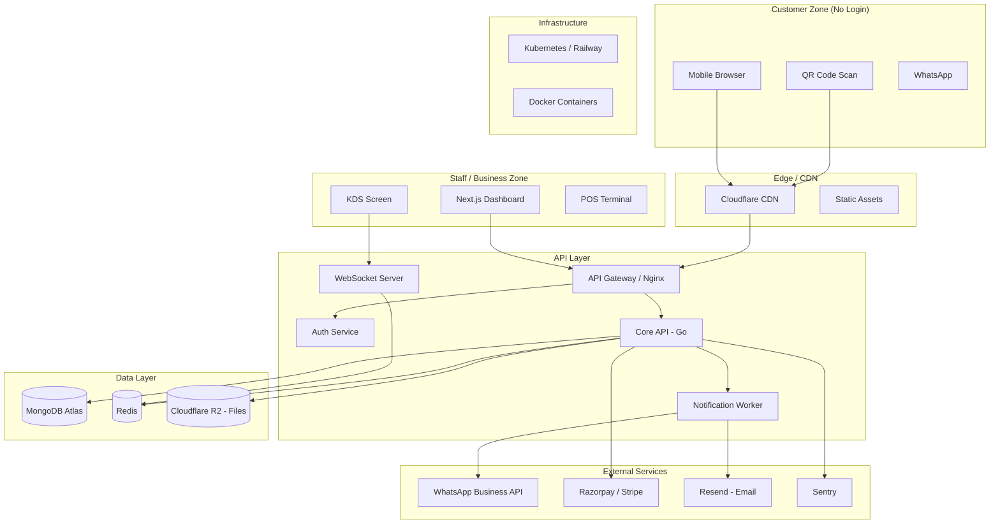
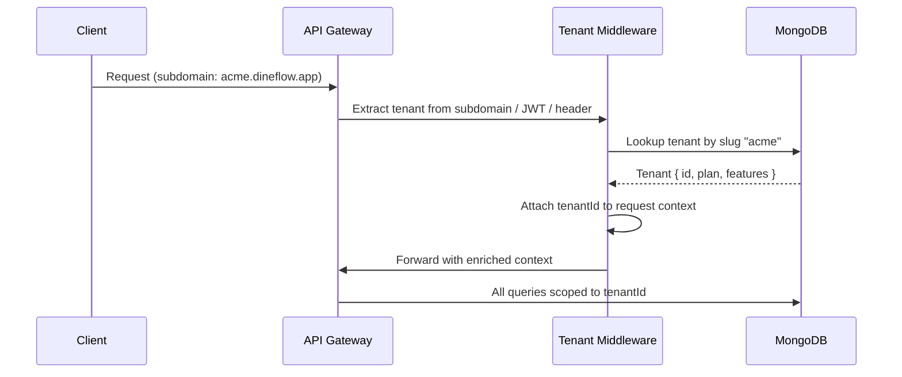
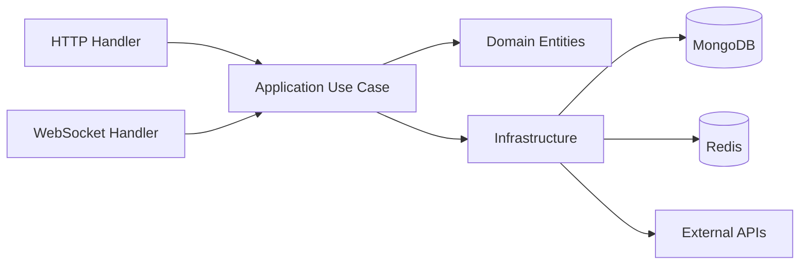
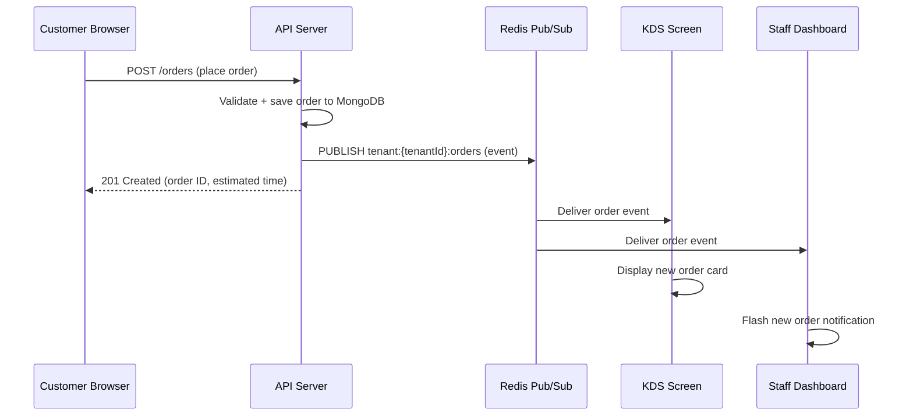
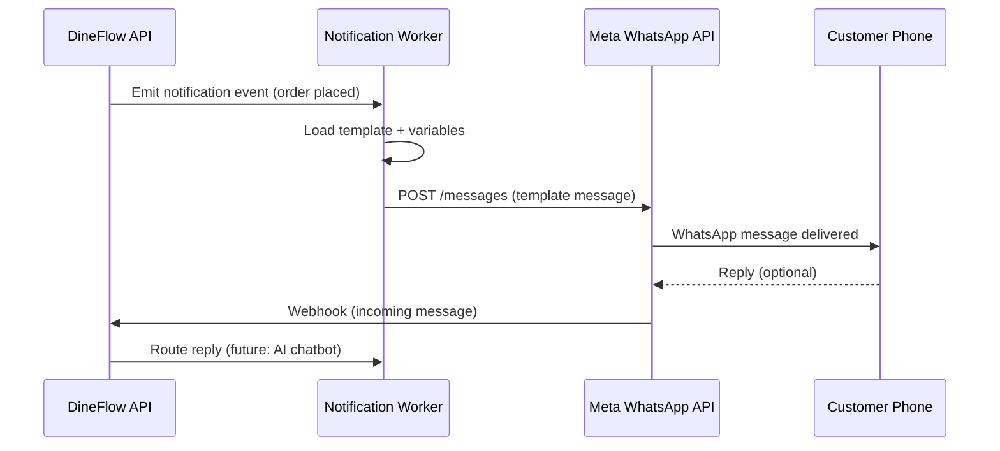
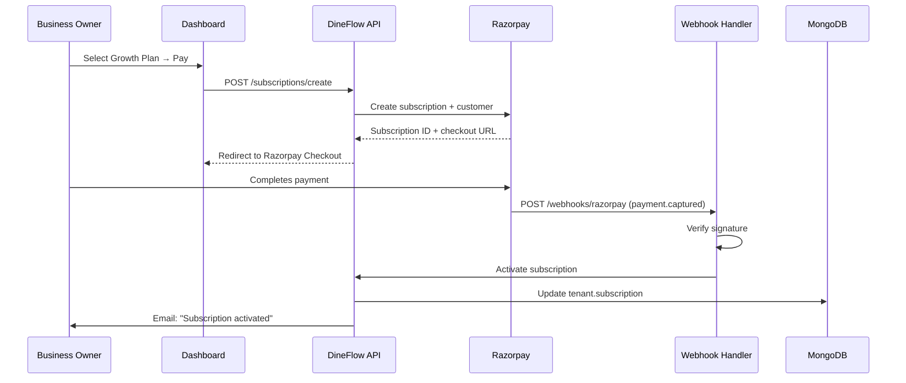
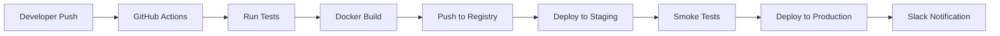

# DineFlow — System Architecture

---

## Architecture Philosophy

DineFlow is designed as a **cloud-native, multi-tenant SaaS platform** following **Clean Architecture** principles. Key design decisions:

1. **Tenant isolation at the database level** — each tenant's data is logically isolated via `tenantId` scoping on every query, with future support for dedicated DB clusters for Hotel Pro tier.
2. **API-first** — all functionality is exposed through a versioned REST + WebSocket API; the frontend is fully decoupled.
3. **Event-driven for real-time** — orders propagate through an event bus (Redis Pub/Sub → WebSockets), ensuring sub-500ms delivery to the KDS.
4. **Feature-flagged from the ground up** — every feature checks the tenant's subscription plan before execution.
5. **Stateless backend** — all servers are stateless; session state lives in Redis or JWTs. Horizontal scaling is trivial.

---

## High-Level Architecture Diagram



---

## Multi-Tenancy Architecture

### Tenant Resolution Flow



### Isolation Strategy

| Approach | Usage |
|---|---|
| **Shared DB, Tenant ID per document** | Default for all tiers (Free, Starter, Growth) |
| **Dedicated MongoDB cluster** | Hotel Pro enterprise contracts (future) |
| **Row-level security** | enforced at application middleware layer |
| **Index strategy** | All collections indexed on `(tenantId, ...)` compound index |

---

## Frontend Architecture

### Stack

| Component | Technology | Reasoning |
|---|---|---|
| Framework | **Next.js 15 (App Router)** | SSR/SSG for ordering pages, RSC for dashboard |
| Language | **TypeScript** | Type safety across monorepo |
| Styling | **Tailwind CSS v4 + CSS Variables** | Design tokens, dark mode, fast iteration |
| State (Server) | **TanStack Query v5** | Cache, background refresh, optimistic updates |
| State (Global) | **Zustand** | Lightweight, no boilerplate |
| Real-time | **Socket.io Client** | Order events, KDS updates |
| Forms | **React Hook Form + Zod** | Validated forms with schema inference |
| Charts | **Recharts** | Lightweight, composable |
| Animations | **Framer Motion** | Premium interactions |
| Icons | **Lucide React** | Consistent, tree-shakeable |
| i18n | **next-intl** | Multi-language support |

### Application Structure

```
apps/
  web/                         ← Next.js App
    app/
      (marketing)/             ← Public marketing pages
      (auth)/                  ← Login, register, verify
      (dashboard)/             ← Authenticated business dashboard
        [tenantSlug]/
          overview/
          orders/
          menu/
          tables/
          kds/
          staff/
          analytics/
          settings/
          billing/
      (ordering)/              ← Customer QR ordering flow
        [tenantSlug]/
          [tableId]/
    components/
      ui/                      ← Base design system components
      layout/                  ← Sidebar, Topbar, Modals
      features/                ← Feature-specific components
    lib/
      api/                     ← API client (typed)
      hooks/                   ← Custom hooks
      store/                   ← Zustand stores
      utils/                   ← Utilities
    middleware.ts               ← Auth + tenant resolution
```

### Customer Ordering Page — SSG + ISR

The customer ordering menu page (`/[tenantSlug]/[tableId]`) is **statically generated with Incremental Static Regeneration (ISR)**:
- Menu data is cached at the CDN edge for 60 seconds
- Re-validated when menu is updated (on-demand revalidation)
- Cart state is client-side only (no server round-trips until order placement)
- Page loads in < 1.5 seconds on 4G

---

## Backend Architecture

### Stack

| Component | Technology | Reasoning |
|---|---|---|
| Language | **Go 1.23** | Performance, concurrency, low memory footprint |
| Web Framework | **Gin** | Fast, minimal, excellent middleware ecosystem |
| WebSocket | **Gorilla WebSocket** | Low-level control, hub pattern |
| ODM | **MongoDB Go Driver (official)** | Direct driver, no abstraction overhead |
| Auth | **JWT (golang-jwt)** | Stateless tokens |
| Queue | **Redis Pub/Sub** (Phase 1) → **BullMQ or Temporal** (Phase 4+) | Gradual upgrade path |
| Email | **Resend SDK** | Excellent DX, reliable delivery |
| WhatsApp | **Meta Cloud API / Gupshup BSP** | Direct API or BSP based on cost |
| Payments | **Razorpay + Stripe** | India-first (Razorpay), global (Stripe) |
| Observability | **Zap logger + Sentry + Prometheus** | Structured logs, error tracking, metrics |

### Service Structure (Clean Architecture)

```
services/
  api/
    cmd/
      server/
        main.go
    internal/
      domain/              ← Entities, value objects, business rules
        tenant/
        menu/
        order/
        subscription/
      application/         ← Use cases (business logic)
        tenant/
        menu/
        order/
        subscription/
      infrastructure/      ← DB, external APIs, messaging
        mongodb/
        redis/
        whatsapp/
        razorpay/
        email/
      interfaces/          ← HTTP handlers, WebSocket handlers
        http/
          routes/
          middleware/
          handlers/
        ws/
          hub.go
          client.go
    pkg/
      errors/
      validator/
      logger/
```

### Clean Architecture Dependency Flow



---

## WebSocket Architecture (Real-Time Orders)



### WebSocket Hub Pattern

```go
// Each tenant gets a dedicated channel room
type Hub struct {
    tenantRooms map[string]*Room  // tenantId → Room
    register    chan *Client
    unregister  chan *Client
}

type Room struct {
    tenantId string
    clients  map[*Client]bool
    broadcast chan []byte
}
```

All KDS, staff dashboard, and ordering page status updates flow through this hub. Redis Pub/Sub is used so multiple API server instances can broadcast to clients connected to any instance (horizontal scale).

---

## Database Architecture

### MongoDB Atlas Configuration

| Setting | Value |
|---|---|
| Cluster Tier | M10 (dev), M30 (production) |
| Region | ap-south-1 (Mumbai) primary |
| Replication | 3-node replica set |
| Backup | Continuous cloud backup |
| Encryption | At-rest AES-256 |

See `DATABASE_DESIGN.md` for full collection schema.

### Redis Architecture

| Usage | Details |
|---|---|
| Session store | JWT refresh token metadata |
| Rate limiting | Sliding window per IP + per tenant |
| Order event Pub/Sub | Channel per tenant |
| QR code cache | Short-lived tenant menu cache |
| Feature flag cache | TTL 5 minutes |
| Real-time counters | Live order counts |

---

## WhatsApp Integration



### WhatsApp Message Templates

| Template | Trigger | Variables |
|---|---|---|
| `order_confirmed` | Order placed | customer_name, order_id, items, est_time |
| `order_preparing` | Status → Preparing | customer_name, order_id |
| `order_ready` | Status → Ready | customer_name, table |
| `payment_failed` | Subscription payment fails | business_name, days_left, renewal_link |
| `grace_warning` | Day 7 of grace period | business_name, days_left |
| `plan_downgraded` | Day 14, downgrade executed | business_name, plan_name |

---

## Payment Architecture



---

## Deployment Architecture

### Infrastructure Stack

| Component | Tool | Notes |
|---|---|---|
| Container Orchestration | **Kubernetes (GKE)** or **Railway.app** | Start with Railway, migrate to K8s at scale |
| Container Registry | **Google Artifact Registry** | |
| CDN | **Cloudflare** | DDoS, caching, SSL |
| Frontend Hosting | **Vercel** | Next.js native |
| Database | **MongoDB Atlas** | Managed, auto-scaling |
| Cache | **Redis Cloud** or **Upstash** | Managed Redis |
| File Storage | **Cloudflare R2** | S3-compatible, no egress fees |
| DNS | **Cloudflare DNS** | Wildcard for tenant subdomains |
| SSL | **Cloudflare + Let's Encrypt** | Auto-renew |
| Secrets | **Doppler** or **GCP Secret Manager** | |
| CI/CD | **GitHub Actions** | |
| Monitoring | **Grafana + Prometheus** | |
| APM | **Sentry** | |
| Uptime | **Better Uptime** | |

### Deployment Pipeline



### Tenant Subdomain Strategy

```
Tenant "pizza-palace" gets:
  Dashboard:   app.dineflow.app/pizza-palace
  Ordering:    order.dineflow.app/pizza-palace/table-1
  API:         api.dineflow.app (tenantId from JWT)

Future (Phase 5):
  Custom domain: menu.pizzapalace.com → proxied through Cloudflare
```

---

## Security Architecture

| Layer | Control |
|---|---|
| Network | Cloudflare WAF, DDoS protection |
| Transport | TLS 1.3 enforced |
| Authentication | JWT (15min access) + refresh token (7 days) in HttpOnly cookie |
| Authorization | RBAC middleware checks role + tenantId on every request |
| Data isolation | Every DB query mandatorily scoped to `tenantId` |
| Rate limiting | Redis sliding window — 100 req/min per IP (public), 1000 req/min per tenant |
| Input validation | Zod (frontend), Go validator (backend) on all inputs |
| File uploads | Virus scanning + file type allowlist + max size |
| Secrets | Never in code, loaded from Secret Manager at startup |
| Audit log | All destructive actions logged with actor, timestamp, change |

---

*Last Updated: September 2026 | Version: 1.0*
