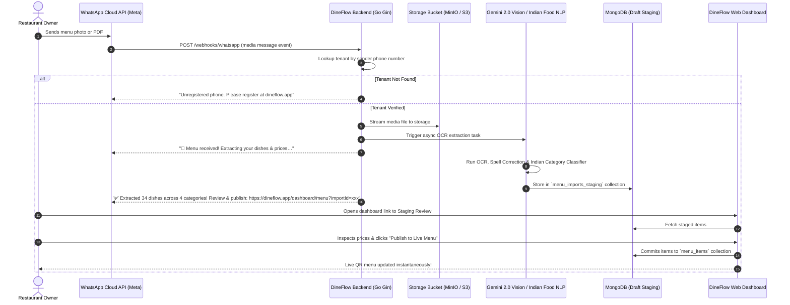

# DineFlow — WhatsApp Menu Import Architecture (Future-Ready Specification)

## 1. Overview & Vision
In India, many restaurant owners, cloud kitchen operators, and café managers manage their business operations through **WhatsApp**. Instead of requiring owners to sit in front of a laptop to manually retype paper menus, DineFlow supports an automated **WhatsApp Menu Import Pipeline**.

A restaurant owner simply snaps a photo of their physical menu (or forwards a distributor PDF) to DineFlow's verified WhatsApp business number. DineFlow automatically processes the file, cleans the OCR text, auto-classifies Indian dishes into categories, detects pricing & dietary indicators, and notifies the owner on WhatsApp and their dashboard with an instant staging preview link.

---

## 2. End-to-End Pipeline Architecture



---

## 3. Webhook Payload & Data Schema

### 3.1 Inbound WhatsApp Webhook (`POST /webhooks/whatsapp`)
```json
{
  "object": "whatsapp_business_account",
  "entry": [
    {
      "id": "WHATSAPP_BUSINESS_ACCOUNT_ID",
      "changes": [
        {
          "value": {
            "messaging_product": "whatsapp",
            "metadata": {
              "display_phone_number": "+919876543210",
              "phone_number_id": "PHONE_NUMBER_ID"
            },
            "contacts": [
              {
                "profile": { "name": "Chef Ramesh" },
                "wa_id": "919876543210"
              }
            ],
            "messages": [
              {
                "from": "919876543210",
                "id": "wamid.HBgLM...",
                "timestamp": "1741872000",
                "type": "image",
                "image": {
                  "caption": "Here is our updated summer menu",
                  "mime_type": "image/jpeg",
                  "sha256": "4355a46b...",
                  "id": "MEDIA_ID"
                }
              }
            ]
          },
          "field": "messages"
        }
      ]
    }
  ]
}
```

### 3.2 Staging Collection (`menu_imports_staging`)
```typescript
interface MenuImportJob {
  id: string; // bson.ObjectID
  tenantId: string; // bson.ObjectID
  senderPhone: string;
  source: "whatsapp" | "web_camera" | "web_upload";
  mediaUrl: string;
  mimeType: string;
  status: "pending" | "processing" | "ready_for_review" | "imported" | "discarded";
  extractedCount: number;
  items: {
    tempId: string;
    name: string;
    hindiName?: string;
    category: string;
    price: number;
    isVeg: boolean;
    spicyLevel: number;
    prepTimeMinutes: number;
    desc: string;
    confidence: number;
  }[];
  createdAt: Date;
  expiresAt: Date; // TTL index 7 days
}
```

---

## 4. Security, Multi-Tenancy & Privacy Controls
1. **Tenant Phone Verification**: Inbound messages are matched against verified user and tenant phone numbers stored in MongoDB. Unverified numbers receive a polite invitation to create an account or verify their number in Settings.
2. **Media Sanitization**: Uploaded images and PDFs are validated for mime type, scanned for size limits ($\le 25\text{MB}$), and stored with restricted private bucket access.
3. **Draft Staging Isolation**: Extracted menus never overwrite live menus directly. They are placed in an isolated staging collection until the owner approves them on the dashboard.
4. **Interactive Audit Trail**: Every item import logs `source: "whatsapp"`, timestamp, and user confirmation for compliance and inventory tracking.
